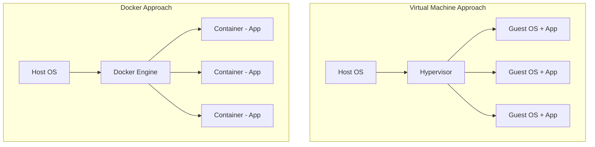
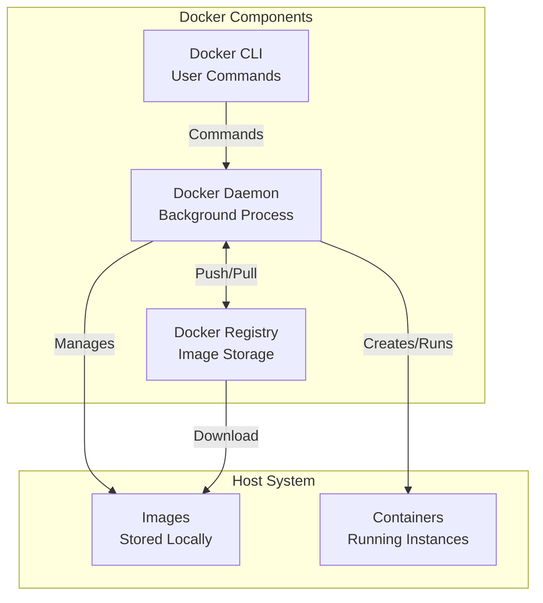

# Chapter 1: Docker Fundamentals

## Table of Contents

1. [What is Docker?](#what-is-docker)
2. [Why Use Docker?](#why-use-docker)
3. [Core Concepts](#core-concepts)
4. [Docker Architecture](#docker-architecture)
5. [Installation and Setup](#installation-and-setup)
6. [Basic Docker Commands](#basic-docker-commands)
7. [Hands-On Exercises](#hands-on-exercises)
8. [Common Mistakes](#common-mistakes)

## What is Docker?

Docker is a platform that enables you to package applications and their dependencies into lightweight, portable containers. Think of Docker containers like shipping containers in the real world:

- **Standardized**: Just like shipping containers have a standard size and shape, Docker containers have a standard format
- **Portable**: Shipping containers can be moved between ships, trucks, and trains. Docker containers can run on any machine with Docker installed
- **Isolated**: Each shipping container is separate from others. Docker containers are isolated from each other and from the host system
- **Self-contained**: Everything needed is inside the container

### The Problem Docker Solves

Before Docker, developers often faced the "it works on my machine" problem:

```
Developer's Machine          Production Server
┌─────────────────┐          ┌─────────────────┐
│ Python 3.11     │          │ Python 3.8      │
│ Ubuntu 22.04    │   ≠      │ CentOS 7        │
│ Node.js 18      │          │ Node.js 14      │
│ PostgreSQL 14   │          │ PostgreSQL 12   │
└─────────────────┘          └─────────────────┘
     Works!                        Fails!
```

With Docker, the environment is consistent:

```
Developer's Machine          Production Server
┌─────────────────┐          ┌─────────────────┐
│ Docker          │   =      │ Docker          │
│ ┌─────────────┐ │          │ ┌─────────────┐ │
│ │ Container   │ │          │ │ Container   │ │
│ │ Python 3.11 │ │          │ │ Python 3.11 │ │
│ │ Ubuntu 22.04│ │          │ │ Ubuntu 22.04│ │
│ └─────────────┘ │          │ └─────────────┘ │
└─────────────────┘          └─────────────────┘
     Works!                        Works!
```

## Why Use Docker?

### Benefits

1. **Consistency**: Same environment across development, testing, and production
2. **Isolation**: Applications don't interfere with each other
3. **Portability**: Run anywhere Docker is installed
4. **Efficiency**: Containers are lightweight compared to virtual machines
5. **Scalability**: Easy to scale applications up or down
6. **Version Control**: Images can be versioned and tagged
7. **Fast Deployment**: Containers start in seconds

### Docker vs Virtual Machines



**Key Differences**:
- **VMs**: Each VM includes a full operating system (heavy, slow to start)
- **Docker**: Containers share the host OS kernel (lightweight, fast to start)

## Core Concepts

### 1. Images

An **image** is a read-only template used to create containers. Think of it as a blueprint or a class in programming.

**Characteristics**:
- Immutable (cannot be changed after creation)
- Layered (built from multiple layers)
- Reusable (one image can create many containers)

**Example**: `python:3.11-slim` is a Docker image containing Python 3.11 on a minimal Linux distribution.

### 2. Containers

A **container** is a running instance of an image. Think of it as an object created from a class.

**Characteristics**:
- Created from images
- Ephemeral (can be created and destroyed easily)
- Isolated (has its own filesystem, network, and processes)

**Lifecycle**:
```
Image → Create → Container (Running) → Stop → Container (Stopped) → Remove
```

### 3. Dockerfile

A **Dockerfile** is a text file containing instructions to build an image. It's like a recipe for creating a container.

**Example Dockerfile**:
```dockerfile
FROM python:3.11-slim
WORKDIR /app
COPY requirements.txt .
RUN pip install -r requirements.txt
COPY . .
CMD ["python", "app.py"]
```

### 4. Docker Compose

**Docker Compose** is a tool for defining and running multi-container Docker applications. Instead of running containers one by one, you define them in a YAML file.

**Use Case**: When you need multiple services working together (database, API, web server, etc.)

## Docker Architecture



### Components Explained

1. **Docker CLI (Command Line Interface)**
   - Tool you use to interact with Docker
   - Commands: `docker build`, `docker run`, `docker ps`, etc.

2. **Docker Daemon**
   - Background process that manages Docker objects
   - Handles image building, container creation, networking, etc.

3. **Docker Registry**
   - Stores Docker images
   - Docker Hub is the default public registry
   - GitHub Container Registry (GHCR) is another option

4. **Docker Images**
   - Stored locally on your machine
   - Can be pulled from registries or built locally

5. **Docker Containers**
   - Running instances created from images
   - Managed by the Docker daemon

## Installation and Setup

### Prerequisites

- Windows 10/11 64-bit, macOS, or Linux
- Administrator/sudo access
- Internet connection

### Installation Steps

#### Windows

1. **Download Docker Desktop**
   - Visit: https://www.docker.com/products/docker-desktop
   - Download Docker Desktop for Windows

2. **Install Docker Desktop**
   - Run the installer
   - Follow the installation wizard
   - Restart your computer if prompted

3. **Verify Installation**
   ```bash
   docker --version
   docker-compose --version
   ```

#### macOS

1. **Download Docker Desktop**
   - Visit: https://www.docker.com/products/docker-desktop
   - Download Docker Desktop for Mac

2. **Install Docker Desktop**
   - Open the downloaded `.dmg` file
   - Drag Docker to Applications folder
   - Launch Docker from Applications

3. **Verify Installation**
   ```bash
   docker --version
   docker-compose --version
   ```

#### Linux (Ubuntu/Debian)

1. **Update package index**
   ```bash
   sudo apt-get update
   ```

2. **Install prerequisites**
   ```bash
   sudo apt-get install \
       ca-certificates \
       curl \
       gnupg \
       lsb-release
   ```

3. **Add Docker's official GPG key**
   ```bash
   sudo mkdir -p /etc/apt/keyrings
   curl -fsSL https://download.docker.com/linux/ubuntu/gpg | sudo gpg --dearmor -o /etc/apt/keyrings/docker.gpg
   ```

4. **Set up repository**
   ```bash
   echo \
     "deb [arch=$(dpkg --print-architecture) signed-by=/etc/apt/keyrings/docker.gpg] https://download.docker.com/linux/ubuntu \
     $(lsb_release -cs) stable" | sudo tee /etc/apt/sources.list.d/docker.list > /dev/null
   ```

5. **Install Docker Engine**
   ```bash
   sudo apt-get update
   sudo apt-get install docker-ce docker-ce-cli containerd.io docker-compose-plugin
   ```

6. **Verify Installation**
   ```bash
   sudo docker --version
   sudo docker-compose --version
   ```

### Post-Installation Setup

#### Test Docker Installation

Run the hello-world container:

```bash
docker run hello-world
```

**Expected Output**:
```
Hello from Docker!
This message shows that your installation appears to be working correctly.
```

#### Configure Docker (Linux)

Add your user to the docker group to run Docker without sudo:

```bash
sudo usermod -aG docker $USER
newgrp docker
```

> **Note**: You may need to log out and log back in for this to take effect.

## Basic Docker Commands

### Image Commands

#### List Images
```bash
docker images
```

**Output**:
```
REPOSITORY    TAG       IMAGE ID       CREATED         SIZE
python        3.11-slim abc123def456   2 weeks ago    120MB
nginx         alpine    def456ghi789   1 week ago     23MB
```

#### Pull an Image
```bash
docker pull python:3.11-slim
```

#### Remove an Image
```bash
docker rmi python:3.11-slim
```

#### Build an Image
```bash
docker build -t my-app:latest .
```

**Explanation**:
- `-t my-app:latest`: Tag the image with name `my-app` and tag `latest`
- `.`: Build context (current directory)

### Container Commands

#### Run a Container
```bash
docker run python:3.11-slim python --version
```

**Common Options**:
- `-d`: Run in detached mode (background)
- `-p 8080:80`: Map port 8080 on host to port 80 in container
- `--name my-container`: Give the container a name
- `-v /host/path:/container/path`: Mount a volume
- `-e KEY=value`: Set environment variable

**Example**:
```bash
docker run -d -p 5000:5000 --name my-api my-app:latest
```

#### List Containers
```bash
# Running containers
docker ps

# All containers (including stopped)
docker ps -a
```

#### Stop a Container
```bash
docker stop my-container
```

#### Start a Stopped Container
```bash
docker start my-container
```

#### Remove a Container
```bash
docker rm my-container
```

#### View Container Logs
```bash
docker logs my-container
```

#### Execute Command in Running Container
```bash
docker exec -it my-container bash
```

**Explanation**:
- `-it`: Interactive terminal
- `bash`: Command to execute (opens a shell)

### Docker Compose Commands

#### Start Services
```bash
docker-compose up
```

**Options**:
- `-d`: Run in detached mode
- `--build`: Rebuild images before starting

#### Stop Services
```bash
docker-compose down
```

#### View Logs
```bash
docker-compose logs
```

#### Rebuild and Restart
```bash
docker-compose up --build
```

## Hands-On Exercises

### Exercise 1: Your First Container

**Goal**: Run a simple Python container and execute a command.

**Steps**:

1. **Pull the Python image**
   ```bash
   docker pull python:3.11-slim
   ```

2. **Run Python interactively**
   ```bash
   docker run -it python:3.11-slim python
   ```

3. **In the Python interpreter, type**:
   ```python
   print("Hello from Docker!")
   exit()
   ```

4. **Verify the container stopped**
   ```bash
   docker ps -a
   ```

### Exercise 2: Create a Simple Web Server

**Goal**: Run an Nginx web server in a container.

**Steps**:

1. **Run Nginx**
   ```bash
   docker run -d -p 8080:80 --name my-webserver nginx:alpine
   ```

2. **Verify it's running**
   ```bash
   docker ps
   ```

3. **Access the web server**
   - Open browser: http://localhost:8080
   - You should see the Nginx welcome page

4. **View logs**
   ```bash
   docker logs my-webserver
   ```

5. **Stop and remove**
   ```bash
   docker stop my-webserver
   docker rm my-webserver
   ```

### Exercise 3: Build Your First Image

**Goal**: Create a simple Dockerfile and build an image.

**Steps**:

1. **Create a directory**
   ```bash
   mkdir my-first-docker
   cd my-first-docker
   ```

2. **Create a simple Python script** (`app.py`):
   ```python
   #!/usr/bin/env python3
   import time
   
   print("Starting application...")
   for i in range(5):
       print(f"Count: {i+1}")
       time.sleep(1)
   print("Application finished!")
   ```

3. **Create a Dockerfile**:
   ```dockerfile
   FROM python:3.11-slim
   
   WORKDIR /app
   
   COPY app.py .
   
   CMD ["python", "app.py"]
   ```

4. **Build the image**
   ```bash
   docker build -t my-app:1.0 .
   ```

5. **Run the container**
   ```bash
   docker run my-app:1.0
   ```

**Expected Output**:
```
Starting application...
Count: 1
Count: 2
Count: 3
Count: 4
Count: 5
Application finished!
```

## Common Mistakes

### Mistake 1: Forgetting to Expose Ports

**Problem**:
```bash
docker run my-app
# Can't access the application from host
```

**Solution**:
```bash
docker run -p 5000:5000 my-app
```

### Mistake 2: Not Using Volumes for Data Persistence

**Problem**:
```bash
docker run my-database
# Data lost when container is removed
```

**Solution**:
```bash
docker run -v my-data:/data my-database
```

### Mistake 3: Running as Root

**Problem**:
```dockerfile
FROM ubuntu
RUN apt-get update
# Container runs as root (security risk)
```

**Solution**:
```dockerfile
FROM ubuntu
RUN useradd -m appuser
USER appuser
```

### Mistake 4: Not Cleaning Up

**Problem**: Accumulating unused images and containers

**Solution**:
```bash
# Remove stopped containers
docker container prune

# Remove unused images
docker image prune

# Remove everything unused
docker system prune
```

### Mistake 5: Copying Files in Wrong Order

**Problem**:
```dockerfile
COPY . .
RUN pip install -r requirements.txt
# Every code change invalidates cache
```

**Solution**:
```dockerfile
COPY requirements.txt .
RUN pip install -r requirements.txt
COPY . .
# Only code changes invalidate cache
```

## Key Takeaways

1. **Docker** packages applications with dependencies into containers
2. **Images** are templates; **containers** are running instances
3. **Dockerfile** defines how to build an image
4. **Docker Compose** manages multi-container applications
5. Containers are **isolated**, **portable**, and **lightweight**

## Next Steps

Now that you understand Docker fundamentals, proceed to:
- [Chapter 2: Project Architecture and Design](02-project-architecture.md) - Learn how Docker is used in this IoT platform
- [Chapter 3: Dockerfile Deep Dive](03-dockerfile-implementation.md) - Master Dockerfile creation

## Additional Resources

- [Docker Official Documentation](https://docs.docker.com/)
- [Docker Hub](https://hub.docker.com/) - Find pre-built images
- [Docker Playground](https://labs.play-with-docker.com/) - Practice Docker online

