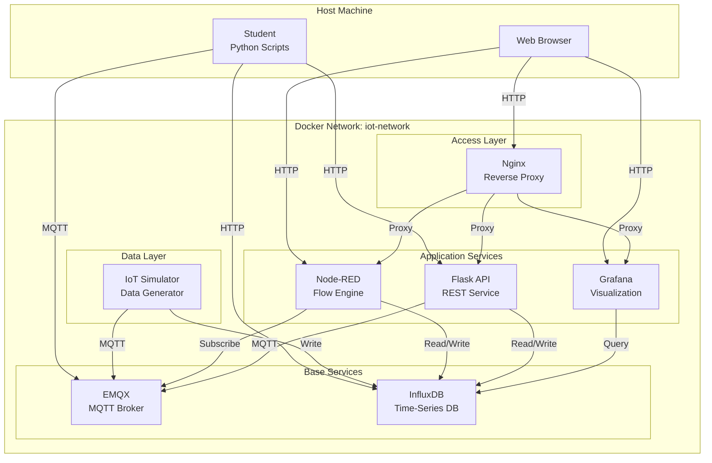
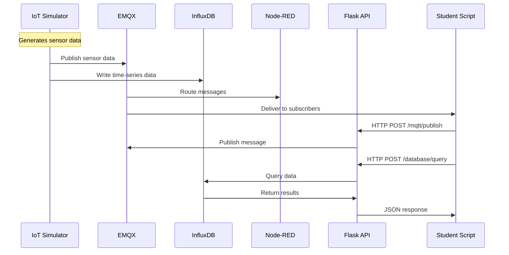
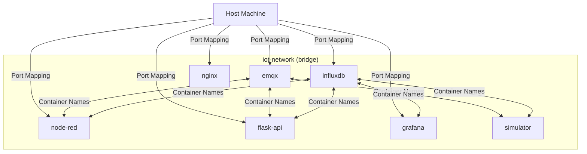
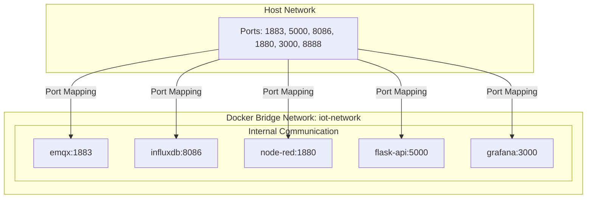
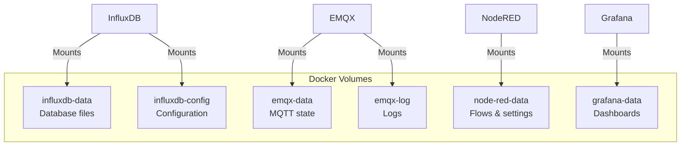
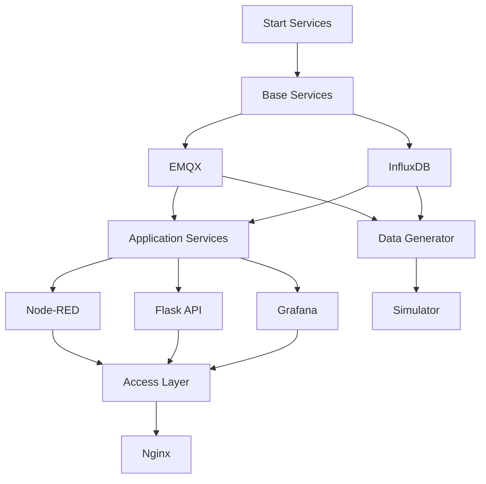

# Chapter 2: Project Architecture and Design

## Table of Contents

1. [Project Overview](#project-overview)
2. [Why Docker for This Project?](#why-docker-for-this-project)
3. [System Architecture](#system-architecture)
4. [Service Breakdown](#service-breakdown)
5. [Design Decisions](#design-decisions)
6. [Network Design](#network-design)
7. [Data Persistence Strategy](#data-persistence-strategy)
8. [Dependency Management](#dependency-management)

## Project Overview

### Project Idea: IoT Home Automation Learning Platform

This project is a comprehensive IoT (Internet of Things) and Home Automation learning environment designed to teach Python programming through real-world IoT services. The platform simulates a complete IoT ecosystem where students can:

- Learn Python programming by interacting with real IoT services
- Understand MQTT messaging protocol
- Work with time-series databases
- Build REST APIs
- Create data visualizations
- Develop home automation scenarios

### Project Goals

1. **Educational**: Provide hands-on learning experience
2. **Realistic**: Use production-grade tools and services
3. **Accessible**: Easy to set up and run locally
4. **Comprehensive**: Cover multiple IoT concepts and technologies

### Without Docker: The Challenge

Setting up this platform without Docker would require:

```
Student's Machine Setup:
├── Install InfluxDB (database)
├── Install EMQX (MQTT broker)
├── Install Node-RED
├── Install Grafana
├── Install Python dependencies
├── Configure each service
├── Set up networking between services
├── Handle port conflicts
├── Manage different OS requirements
└── Troubleshoot environment-specific issues

Result: Hours of setup, high chance of failure
```

**Problems**:
- Different installation steps for Windows, macOS, Linux
- Version conflicts between services
- Complex configuration
- Difficult to share and reproduce
- Hard to clean up

## Why Docker for This Project?

### Benefits for This Project

1. **One-Command Setup**: `docker-compose up -d`
2. **Consistency**: Same environment for all students
3. **Isolation**: Services don't interfere with host system
4. **Portability**: Works on any OS with Docker
5. **Easy Cleanup**: Remove everything with one command
6. **Version Control**: Docker images are versioned
7. **Scalability**: Easy to add or remove services

### Before and After Comparison

**Before Docker**:
```
Student Setup Time: 2-4 hours
Success Rate: ~60%
Common Issues:
- Service conflicts
- Port already in use
- Missing dependencies
- Configuration errors
- OS-specific problems
```

**With Docker**:
```
Student Setup Time: 5-10 minutes
Success Rate: ~95%
Benefits:
- Single command to start
- No conflicts
- All dependencies included
- Pre-configured
- Works everywhere
```

## System Architecture

### High-Level Architecture



### Service Communication Flow



## Service Breakdown

### Base Services

These services have no dependencies and start first.

#### 1. EMQX (MQTT Broker)

**Purpose**: Message broker for IoT device communication

**Why EMQX?**
- Production-grade MQTT broker
- Supports MQTT 3.1.1 and 5.0
- WebSocket support for web clients
- Built-in dashboard for monitoring

**Configuration**:
- Port 1883: MQTT protocol
- Port 8083: MQTT over WebSocket
- Port 18083: Web dashboard

**Docker Configuration**:
```yaml
emqx:
  image: emqx/emqx:5.3
  ports:
    - "1883:1883"
    - "18083:18083"
```

#### 2. InfluxDB (Time-Series Database)

**Purpose**: Store sensor data over time

**Why InfluxDB?**
- Optimized for time-series data
- Efficient storage and queries
- Built-in retention policies
- Flux query language

**Configuration**:
- Port 8086: HTTP API
- Pre-configured organization and bucket
- Admin token for authentication

**Docker Configuration**:
```yaml
influxdb:
  image: influxdb:2.7
  ports:
    - "8086:8086"
  environment:
    - DOCKER_INFLUXDB_INIT_MODE=setup
    - DOCKER_INFLUXDB_INIT_ORG=iot-org
    - DOCKER_INFLUXDB_INIT_BUCKET=iot-data
```

### Application Services

These services depend on base services.

#### 3. Node-RED (Flow Engine)

**Purpose**: Visual programming and dashboard

**Why Node-RED?**
- Visual flow-based programming
- Easy to create dashboards
- MQTT and InfluxDB integration
- Great for teaching automation concepts

**Customization**: Extended with FlowFuse Dashboard

**Docker Configuration**:
```yaml
node-red:
  build:
    context: ./node-red
    dockerfile: Dockerfile
  depends_on:
    - emqx
    - influxdb
```

#### 4. Flask API (REST Service)

**Purpose**: HTTP API for Python interactions

**Why Flask?**
- Simple and Pythonic
- Easy to learn
- Good for teaching REST APIs
- Lightweight

**Features**:
- MQTT publishing/subscribing endpoints
- Database read/write endpoints
- Device management endpoints

**Docker Configuration**:
```yaml
flask-api:
  build:
    context: ../api
  depends_on:
    - emqx
    - influxdb
    - grafana
```

#### 5. Grafana (Visualization)

**Purpose**: Advanced data visualization

**Why Grafana?**
- Professional dashboards
- Time-series visualization
- Multiple data source support
- Great for teaching data analysis

**Pre-configured**: InfluxDB datasource and sample dashboards

**Docker Configuration**:
```yaml
grafana:
  image: grafana/grafana:10.2.0
  depends_on:
    - influxdb
```

### Data Generator

#### 6. IoT Simulator

**Purpose**: Generate realistic sensor data

**Features**:
- Simulates temperature sensors
- Simulates humidity sensors
- Simulates smart switches
- Publishes to MQTT
- Writes to InfluxDB

**Why Separate Container?**
- Isolated from other services
- Easy to start/stop independently
- Can be replaced with real devices

**Docker Configuration**:
```yaml
simulator:
  build:
    context: ../simulator
  depends_on:
    - emqx
    - influxdb
```

### Access Layer

#### 7. Nginx (Reverse Proxy)

**Purpose**: Unified access point

**Why Nginx?**
- Lightweight and fast
- Easy to configure
- Reverse proxy capabilities
- Single entry point for all services

**Configuration**: Routes requests to appropriate services

**Docker Configuration**:
```yaml
nginx:
  image: nginx:alpine
  ports:
    - "8888:80"
  depends_on:
    - node-red
    - flask-api
    - grafana
```

## Design Decisions

### Decision 1: Why Docker Compose?

**Alternatives Considered**:
1. Individual `docker run` commands
2. Docker Swarm
3. Kubernetes

**Chosen**: Docker Compose

**Reasons**:
- **Simplicity**: Single YAML file defines everything
- **Learning Curve**: Easier for students to understand
- **Local Development**: Perfect for local learning environment
- **No Overhead**: No need for orchestration complexity

**Example Without Compose**:
```bash
# Would need to run 7+ commands:
docker network create iot-network
docker run -d --name emqx --network iot-network ...
docker run -d --name influxdb --network iot-network ...
# ... and 5 more services
```

**With Compose**:
```bash
# Single command:
docker-compose up -d
```

### Decision 2: Network Design

**Chosen**: Single bridge network (`iot-network`)

**Why?**
- **Isolation**: Services isolated from host and other Docker networks
- **Service Discovery**: Containers can communicate by name
- **Simplicity**: One network for all services
- **Security**: Services not exposed to host unnecessarily

**Network Topology**:


**Service Discovery**:
- Containers use service names (e.g., `emqx`, `influxdb`)
- Docker DNS resolves names to IP addresses
- No need to know IP addresses

### Decision 3: Volume Strategy

**Chosen**: Named volumes for data persistence

**Volume Types Used**:

1. **Named Volumes** (for data):
   ```yaml
   volumes:
     - influxdb-data:/var/lib/influxdb2
     - node-red-data:/data
   ```
   - Managed by Docker
   - Persistent across container restarts
   - Easy to backup

2. **Bind Mounts** (for development):
   ```yaml
   volumes:
     - ../api:/app
   ```
   - Direct mapping to host filesystem
   - Useful for code development
   - Changes reflect immediately

**Why This Strategy?**
- **Data Persistence**: Important data survives container removal
- **Development**: Code changes without rebuilding images
- **Backup**: Easy to backup named volumes
- **Performance**: Named volumes are optimized by Docker

### Decision 4: Health Checks

**Why Health Checks?**
- Ensure services are ready before dependent services start
- Automatic recovery from failures
- Better dependency management

**Example**:
```yaml
healthcheck:
  test: ["CMD", "curl", "-f", "http://localhost:5000/health"]
  interval: 10s
  timeout: 5s
  retries: 5
```

**Benefits**:
- `depends_on` can wait for health, not just startup
- Docker Compose knows when services are ready
- Better error messages

### Decision 5: Image Strategy

**Mixed Approach**:
- **Pre-built Images**: For standard services (InfluxDB, EMQX, Grafana, Nginx)
- **Custom Images**: For project-specific services (Node-RED, Flask API, Simulator)

**Why?**
- **Pre-built**: Faster startup, maintained by vendors
- **Custom**: Control over dependencies and configuration

## Network Design

### Network Architecture



### Port Mapping Strategy

**External Ports** (accessible from host):
- 1883: EMQX MQTT
- 5000: Flask API
- 8086: InfluxDB
- 1880: Node-RED
- 3000: Grafana
- 8888: Nginx (reverse proxy)

**Internal Communication**:
- Services use container names and internal ports
- No port conflicts
- Secure by default (not exposed unless needed)

## Data Persistence Strategy

### Volume Mapping



### Persistence Benefits

1. **Data Survival**: Data persists when containers are removed
2. **Easy Backup**: Volumes can be backed up
3. **Performance**: Named volumes are optimized
4. **Isolation**: Data separated from host filesystem

## Dependency Management

### Startup Order



### Dependency Configuration

**Using `depends_on`**:
```yaml
node-red:
  depends_on:
    - emqx
    - influxdb
```

**Benefits**:
- Services start in correct order
- Clear dependency relationships
- Better error messages

## Key Takeaways

1. **Docker Compose** simplifies multi-service management
2. **Single network** provides isolation and service discovery
3. **Named volumes** ensure data persistence
4. **Health checks** improve reliability
5. **Mixed image strategy** balances speed and control

## Next Steps

Now that you understand the project architecture, proceed to:
- [Chapter 3: Dockerfile Deep Dive](03-dockerfile-implementation.md) - Learn how to create custom images
- [Chapter 4: Docker Compose Configuration](04-docker-compose-setup.md) - Master Docker Compose setup

## Related Documentation

- [Architecture Overview](../../workshop/docs/Architecture/architecture-overview.md) - Detailed system architecture
- [Data Flow](../../workshop/docs/Architecture/data-flow.md) - How data moves through the system

