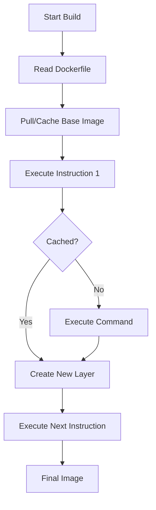

# Chapter 3: Dockerfile Deep Dive

## Table of Contents

1. [Dockerfile Basics](#dockerfile-basics)
2. [Dockerfile Syntax](#dockerfile-syntax)
3. [Best Practices](#best-practices)
4. [Node-RED Dockerfile Analysis](#node-red-dockerfile-analysis)
5. [Flask API Dockerfile Analysis](#flask-api-dockerfile-analysis)
6. [Simulator Dockerfile Analysis](#simulator-dockerfile-analysis)
7. [Building Custom Images](#building-custom-images)
8. [Layer Caching Optimization](#layer-caching-optimization)
9. [Security Considerations](#security-considerations)

## Dockerfile Basics

### What is a Dockerfile?

A **Dockerfile** is a text file containing instructions for building a Docker image. Each instruction creates a new layer in the image.

**Analogy**: Think of a Dockerfile as a recipe:
- Ingredients = Base image and files
- Instructions = Commands to run
- Final dish = Docker image

### Basic Structure

```dockerfile
# Comment: Description of what this does
INSTRUCTION arguments

# Example:
FROM python:3.11-slim
WORKDIR /app
COPY . .
RUN pip install -r requirements.txt
CMD ["python", "app.py"]
```

## Dockerfile Syntax

### Common Instructions

#### FROM
**Purpose**: Specify the base image

**Syntax**:
```dockerfile
FROM <image>[:<tag>]
```

**Examples**:
```dockerfile
FROM python:3.11-slim
FROM node:18-alpine
FROM ubuntu:22.04
```

**Best Practice**: Use specific tags, not `latest`

#### WORKDIR
**Purpose**: Set the working directory for subsequent instructions

**Syntax**:
```dockerfile
WORKDIR /path/to/directory
```

**Example**:
```dockerfile
WORKDIR /app
# All subsequent commands run in /app
```

**Why Use It?**: 
- Creates directory if it doesn't exist
- All relative paths are relative to WORKDIR
- Cleaner than using `RUN cd /app && ...`

#### COPY
**Purpose**: Copy files from host to image

**Syntax**:
```dockerfile
COPY <source> <destination>
```

**Examples**:
```dockerfile
COPY requirements.txt .
COPY app.py /app/
COPY . /app/
```

**Important**: 
- Source is relative to build context
- Destination is inside the container

#### ADD
**Purpose**: Similar to COPY, but can also:
- Download URLs
- Extract tar files

**When to Use**: Generally avoid ADD, use COPY instead (more predictable)

#### RUN
**Purpose**: Execute commands during image build

**Syntax**:
```dockerfile
RUN <command>
RUN ["executable", "param1", "param2"]
```

**Examples**:
```dockerfile
RUN apt-get update && apt-get install -y curl
RUN pip install -r requirements.txt
RUN npm install
```

**Best Practice**: Combine commands with `&&` to reduce layers

#### CMD
**Purpose**: Default command to run when container starts

**Syntax**:
```dockerfile
CMD ["executable", "param1", "param2"]  # Exec form (preferred)
CMD command param1 param2                # Shell form
```

**Example**:
```dockerfile
CMD ["python", "app.py"]
```

**Important**: Only one CMD per Dockerfile (last one wins)

#### ENV
**Purpose**: Set environment variables

**Syntax**:
```dockerfile
ENV KEY=value
ENV KEY1=value1 KEY2=value2
```

**Example**:
```dockerfile
ENV PYTHONUNBUFFERED=1
ENV FLASK_APP=app.py
```

#### EXPOSE
**Purpose**: Document which ports the container listens on

**Syntax**:
```dockerfile
EXPOSE <port>
EXPOSE <port>/<protocol>
```

**Example**:
```dockerfile
EXPOSE 5000
EXPOSE 8080/tcp
```

**Note**: EXPOSE doesn't actually publish the port (that's done with `-p` flag)

#### USER
**Purpose**: Set the user for subsequent instructions

**Syntax**:
```dockerfile
USER <user>[:<group>]
```

**Example**:
```dockerfile
USER node
USER 1000:1000
```

**Security**: Don't run as root!

#### HEALTHCHECK
**Purpose**: Define how to check if container is healthy

**Syntax**:
```dockerfile
HEALTHCHECK [OPTIONS] CMD command
```

**Example**:
```dockerfile
HEALTHCHECK --interval=30s --timeout=10s \
  CMD curl -f http://localhost:5000/health || exit 1
```

## Best Practices

### 1. Use Specific Base Image Tags

**Bad**:
```dockerfile
FROM python:latest
```

**Good**:
```dockerfile
FROM python:3.11-slim
```

**Why**: `latest` can change, breaking your builds

### 2. Order Instructions by Change Frequency

**Bad**:
```dockerfile
FROM python:3.11-slim
COPY . .
RUN pip install -r requirements.txt
```

**Problem**: Every code change invalidates pip install cache

**Good**:
```dockerfile
FROM python:3.11-slim
COPY requirements.txt .
RUN pip install -r requirements.txt
COPY . .
```

**Benefit**: Code changes don't invalidate dependency installation

### 3. Combine RUN Commands

**Bad**:
```dockerfile
RUN apt-get update
RUN apt-get install -y curl
RUN apt-get install -y wget
RUN rm -rf /var/lib/apt/lists/*
```

**Problem**: Creates 4 layers

**Good**:
```dockerfile
RUN apt-get update && \
    apt-get install -y curl wget && \
    rm -rf /var/lib/apt/lists/*
```

**Benefit**: Creates 1 layer, smaller image

### 4. Use .dockerignore

Create `.dockerignore` file:
```
__pycache__
*.pyc
.git
.env
node_modules
*.md
```

**Benefit**: Excludes unnecessary files from build context

### 5. Don't Run as Root

**Bad**:
```dockerfile
FROM ubuntu
RUN apt-get update
# Runs as root (security risk)
```

**Good**:
```dockerfile
FROM ubuntu
RUN useradd -m appuser
USER appuser
# Runs as non-root user
```

## Node-RED Dockerfile Analysis

### Complete Dockerfile

Let's analyze `docker/node-red/Dockerfile`:

```dockerfile
FROM nodered/node-red:latest

# Switch to root to install packages
USER root

# Copy package.json
COPY package.json /data/package.json

# Install FlowFuse Dashboard and other dependencies
RUN cd /data && npm install --production --unsafe-perm

# Copy flows
COPY flows.json /data/flows.json

# Switch back to node-red user
USER node-red
```

### Line-by-Line Explanation

#### Line 1: Base Image
```dockerfile
FROM nodered/node-red:latest
```

**What it does**: Uses official Node-RED image as base

**Why this image?**:
- Pre-configured Node-RED environment
- Includes Node.js and npm
- Already has Node-RED installed

**Note**: In production, consider using a specific version tag

#### Line 3-4: Switch to Root
```dockerfile
# Switch to root to install packages
USER root
```

**What it does**: Temporarily switches to root user

**Why needed?**: 
- Need root permissions to install npm packages
- Base image runs as `node-red` user (non-root)

**Security Note**: We switch back to non-root later

#### Line 6-7: Copy Package File
```dockerfile
# Copy package.json
COPY package.json /data/package.json
```

**What it does**: Copies package.json to container

**Why `/data`?**: 
- Node-RED stores data in `/data` directory
- This is the standard location for Node-RED

**Why copy only package.json first?**: 
- Enables layer caching
- If package.json doesn't change, npm install is cached

#### Line 9-10: Install Dependencies
```dockerfile
# Install FlowFuse Dashboard and other dependencies
RUN cd /data && npm install --production --unsafe-perm
```

**What it does**: 
- Changes to `/data` directory
- Installs npm packages from package.json

**Flags Explained**:
- `--production`: Only installs production dependencies (not devDependencies)
- `--unsafe-perm`: Allows npm to run as root (needed for some native modules)

**Why `cd /data &&`?**: 
- Ensures npm install runs in correct directory
- Could use `WORKDIR /data` instead

#### Line 12-13: Copy Flows
```dockerfile
# Copy flows
COPY flows.json /data/flows.json
```

**What it does**: Copies pre-configured Node-RED flows

**Why separate COPY?**: 
- Flows change more frequently than dependencies
- Separate layer for better caching

#### Line 15-16: Switch Back to Non-Root
```dockerfile
# Switch back to node-red user
USER node-red
```

**What it does**: Returns to non-root user

**Why important?**: 
- Security best practice
- Container runs with minimal privileges
- Reduces attack surface

### Optimization Suggestions

**Current**:
```dockerfile
RUN cd /data && npm install --production --unsafe-perm
```

**Could be**:
```dockerfile
WORKDIR /data
RUN npm install --production --unsafe-perm
```

**Benefit**: Cleaner, more idiomatic Docker

## Flask API Dockerfile Analysis

### Complete Dockerfile

Let's analyze `api/Dockerfile`:

```dockerfile
FROM python:3.11-slim

WORKDIR /app

# Install system dependencies
RUN apt-get update && apt-get install -y \
    curl \
    && rm -rf /var/lib/apt/lists/*

# Copy requirements and install Python dependencies
COPY requirements.txt .
RUN pip install --no-cache-dir -r requirements.txt

# Copy application code
COPY . .

# Expose port
EXPOSE 5000

# Health check
HEALTHCHECK --interval=30s --timeout=10s --start-period=5s --retries=3 \
    CMD curl -f http://localhost:5000/health || exit 1

# Run the application
CMD ["python", "app.py"]
```

### Line-by-Line Explanation

#### Line 1: Base Image
```dockerfile
FROM python:3.11-slim
```

**What it does**: Uses Python 3.11 on Debian slim

**Why `slim`?**: 
- Smaller image size (~120MB vs ~900MB for full Python)
- Includes only essential packages
- Faster to pull and build

#### Line 3: Set Working Directory
```dockerfile
WORKDIR /app
```

**What it does**: Sets `/app` as working directory

**Benefits**: 
- All subsequent commands run in `/app`
- Relative paths are relative to `/app`
- Directory created if it doesn't exist

#### Line 5-8: Install System Dependencies
```dockerfile
# Install system dependencies
RUN apt-get update && apt-get install -y \
    curl \
    && rm -rf /var/lib/apt/lists/*
```

**What it does**: 
- Updates package list
- Installs `curl` (needed for health check)
- Removes package lists to reduce image size

**Why combine commands?**: 
- Creates single layer
- `rm -rf /var/lib/apt/lists/*` reduces image size significantly

**Best Practice**: Always clean up apt cache

#### Line 10-12: Install Python Dependencies
```dockerfile
# Copy requirements and install Python dependencies
COPY requirements.txt .
RUN pip install --no-cache-dir -r requirements.txt
```

**What it does**: 
- Copies requirements file first
- Installs Python packages

**Why copy requirements.txt first?**: 
- Layer caching optimization
- If requirements.txt doesn't change, pip install is cached
- Code changes don't invalidate dependency installation

**Flag `--no-cache-dir`**: 
- Doesn't store pip cache
- Reduces image size

#### Line 14-15: Copy Application Code
```dockerfile
# Copy application code
COPY . .
```

**What it does**: Copies all application files

**Why last?**: 
- Code changes frequently
- Doesn't invalidate previous layers
- Better caching strategy

**Note**: Use `.dockerignore` to exclude unnecessary files

#### Line 17-18: Expose Port
```dockerfile
# Expose port
EXPOSE 5000
```

**What it does**: Documents that container listens on port 5000

**Note**: Doesn't actually publish the port (done with `-p` flag)

#### Line 20-22: Health Check
```dockerfile
# Health check
HEALTHCHECK --interval=30s --timeout=10s --start-period=5s --retries=3 \
    CMD curl -f http://localhost:5000/health || exit 1
```

**What it does**: 
- Checks container health every 30 seconds
- Allows 5 seconds for startup
- Times out after 10 seconds
- Retries 3 times before marking unhealthy

**Options Explained**:
- `--interval=30s`: Check every 30 seconds
- `--timeout=10s`: Command must complete in 10 seconds
- `--start-period=5s`: Allow 5 seconds for initial startup
- `--retries=3`: Mark unhealthy after 3 failures

**Why important?**: 
- Docker knows when service is ready
- Can be used with `depends_on` health condition
- Better error messages

#### Line 24-25: Run Application
```dockerfile
# Run the application
CMD ["python", "app.py"]
```

**What it does**: Default command when container starts

**Exec form vs Shell form**:
- `["python", "app.py"]`: Exec form (preferred)
  - No shell processing
  - Better signal handling
  - More secure
- `python app.py`: Shell form
  - Uses shell (`/bin/sh -c`)
  - Less efficient

## Simulator Dockerfile Analysis

### Complete Dockerfile

Let's analyze `simulator/Dockerfile`:

```dockerfile
FROM python:3.11-slim

WORKDIR /app

# Install system dependencies
RUN apt-get update && apt-get install -y \
    && rm -rf /var/lib/apt/lists/*

# Copy requirements and install Python dependencies
COPY requirements.txt .
RUN pip install --no-cache-dir -r requirements.txt

# Copy application code
COPY . .

# Run the simulator
CMD ["python", "iot_simulator.py"]
```

### Key Differences from Flask API

1. **No curl installation**: Doesn't need health check
2. **No EXPOSE**: No external ports needed (internal only)
3. **No HEALTHCHECK**: Simpler service, no health endpoint
4. **Different CMD**: Runs simulator script

### Similarities

- Same base image
- Same layer caching strategy
- Same dependency installation pattern

## Building Custom Images

### Basic Build Command

```bash
docker build -t image-name:tag .
```

**Options**:
- `-t`: Tag the image with name and optional tag
- `.`: Build context (current directory)

### Build Process



### Build Examples

#### Build Node-RED Image
```bash
cd docker/node-red
docker build -t iot-node-red:latest .
```

#### Build Flask API Image
```bash
cd api
docker build -t iot-flask-api:latest .
```

#### Build Simulator Image
```bash
cd simulator
docker build -t iot-simulator:latest .
```

### Build Output

**Example**:
```
Sending build context to Docker daemon  2.048kB
Step 1/8 : FROM python:3.11-slim
 ---> abc123def456
Step 2/8 : WORKDIR /app
 ---> Using cache
 ---> def456ghi789
Step 3/8 : RUN apt-get update && apt-get install -y curl
 ---> Running in xyz789abc123
 ---> ghi789jkl012
...
Successfully built jkl012mno345
Successfully tagged iot-flask-api:latest
```

### Understanding Build Output

- **Step X/Y**: Instruction number X of Y total
- **---> Using cache**: Layer was cached (fast!)
- **---> Running in ...**: Executing command (slower)
- **Successfully built**: Image created successfully

## Layer Caching Optimization

### How Layer Caching Works

Docker caches each layer. If a layer hasn't changed, Docker reuses the cached version.

### Example: Optimized Dockerfile

```dockerfile
# Layer 1: Base image (cached if already pulled)
FROM python:3.11-slim

# Layer 2: Working directory (cached if unchanged)
WORKDIR /app

# Layer 3: System packages (cached if unchanged)
RUN apt-get update && apt-get install -y curl

# Layer 4: Copy requirements (cached if requirements.txt unchanged)
COPY requirements.txt .

# Layer 5: Install dependencies (cached if requirements.txt unchanged)
RUN pip install -r requirements.txt

# Layer 6: Copy code (changes frequently, invalidates cache)
COPY . .

# Layer 7: Command (cached if unchanged)
CMD ["python", "app.py"]
```

### Cache Invalidation

**Scenario 1**: Change `app.py`
- Layers 1-5: Cached (reused)
- Layer 6: Invalidated (must rebuild)
- Layer 7: Cached (reused)

**Scenario 2**: Change `requirements.txt`
- Layers 1-3: Cached (reused)
- Layer 4: Invalidated (must rebuild)
- Layers 5-7: Invalidated (must rebuild)

**Key Insight**: Order matters! Put frequently changing files last.

### Testing Dockerfiles

#### Build with No Cache
```bash
docker build --no-cache -t my-image .
```

**Use Case**: 
- Testing Dockerfile from scratch
- Ensuring reproducible builds

#### Build with Progress Output
```bash
docker build --progress=plain -t my-image .
```

**Use Case**: 
- Debugging build issues
- Seeing detailed output

## Security Considerations

### 1. Use Minimal Base Images

**Bad**:
```dockerfile
FROM ubuntu:latest
# Large image with many packages
```

**Good**:
```dockerfile
FROM python:3.11-slim
# Minimal image with only essentials
```

**Benefits**: 
- Smaller attack surface
- Faster builds
- Less to maintain

### 2. Don't Run as Root

**Bad**:
```dockerfile
FROM python:3.11-slim
# Runs as root (UID 0)
```

**Good**:
```dockerfile
FROM python:3.11-slim
RUN useradd -m appuser
USER appuser
# Runs as non-root user
```

**Benefits**: 
- Reduced privilege escalation risk
- Better security isolation

### 3. Keep Images Updated

**Regularly update**:
- Base images
- System packages
- Application dependencies

**Check for vulnerabilities**:
```bash
docker scan my-image
```

### 4. Use .dockerignore

**Create `.dockerignore`**:
```
.env
.git
*.md
__pycache__
*.pyc
node_modules
```

**Benefits**: 
- Excludes sensitive files
- Smaller build context
- Faster builds

### 5. Don't Store Secrets in Images

**Bad**:
```dockerfile
ENV API_KEY=secret123
```

**Good**:
```dockerfile
# Use environment variables at runtime
# docker run -e API_KEY=secret123 my-image
```

**Or use Docker secrets** (advanced topic)

## Key Takeaways

1. **Dockerfile** is a recipe for building images
2. **Order matters** for layer caching
3. **Copy dependencies first**, code last
4. **Combine RUN commands** to reduce layers
5. **Don't run as root** for security
6. **Use minimal base images**
7. **Health checks** improve reliability

## Next Steps

Now that you understand Dockerfiles, proceed to:
- [Chapter 4: Docker Compose Configuration](04-docker-compose-setup.md) - Learn how to orchestrate multiple containers
- [Chapter 5: Building and Running](05-building-and-running.md) - Practice building and running containers

## Exercises

1. **Modify the Flask API Dockerfile** to run as a non-root user
2. **Optimize the Node-RED Dockerfile** to use WORKDIR instead of `cd`
3. **Create a .dockerignore file** for the Flask API project
4. **Build all three images** and compare their sizes

