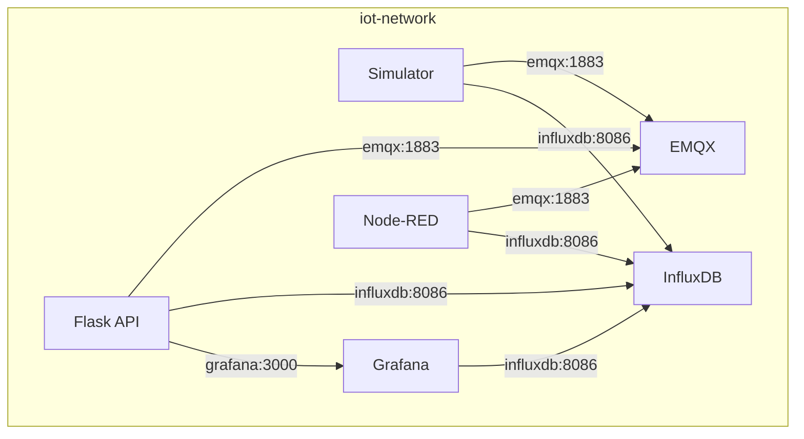
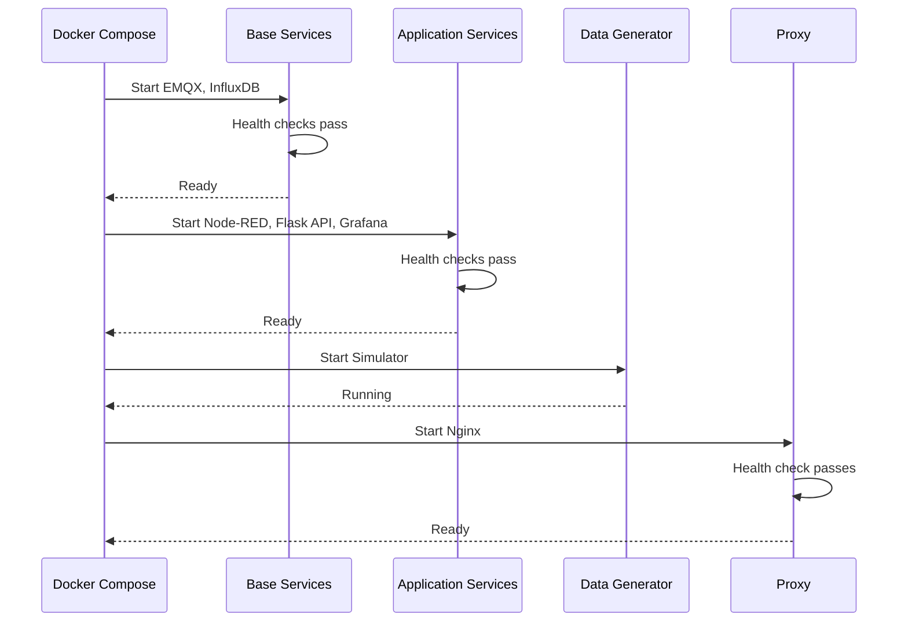

# Chapter 4: Docker Compose Configuration

## Table of Contents

1. [Docker Compose Fundamentals](#docker-compose-fundamentals)
2. [YAML Syntax Basics](#yaml-syntax-basics)
3. [Service Configuration Explained](#service-configuration-explained)
4. [Complete docker-compose.yml Walkthrough](#complete-docker-composeyml-walkthrough)
5. [Service Communication Patterns](#service-communication-patterns)
6. [Data Persistence Strategy](#data-persistence-strategy)
7. [Environment Variables](#environment-variables)
8. [Health Checks and Dependencies](#health-checks-and-dependencies)

## Docker Compose Fundamentals

### What is Docker Compose?

**Docker Compose** is a tool for defining and running multi-container Docker applications. Instead of running multiple `docker run` commands, you define everything in a YAML file.

### Why Use Docker Compose?

**Without Compose**:
```bash
# Create network
docker network create iot-network

# Run EMQX
docker run -d --name emqx --network iot-network \
  -p 1883:1883 -p 18083:18083 emqx/emqx:5.3

# Run InfluxDB
docker run -d --name influxdb --network iot-network \
  -p 8086:8086 \
  -e DOCKER_INFLUXDB_INIT_MODE=setup \
  -e DOCKER_INFLUXDB_INIT_ORG=iot-org \
  -v influxdb-data:/var/lib/influxdb2 \
  influxdb:2.7

# ... and 5 more services!
```

**With Compose**:
```bash
docker-compose up -d
```

**Benefits**:
- Single command to start everything
- Configuration in one file
- Easy to version control
- Automatic dependency management
- Network and volume management

## YAML Syntax Basics

### Basic Structure

Docker Compose files use YAML (YAML Ain't Markup Language) format.

**Key Rules**:
- Indentation matters (use spaces, not tabs)
- Key-value pairs
- Lists use dashes
- Comments start with `#`

### Example Structure

```yaml
version: '3.8'  # Optional in newer versions

services:
  service-name:
    image: image-name:tag
    ports:
      - "8080:80"
    environment:
      - KEY=value

volumes:
  volume-name:

networks:
  network-name:
```

## Service Configuration Explained

### Image vs Build

#### Using Pre-built Images

```yaml
services:
  influxdb:
    image: influxdb:2.7
```

**When to use**: 
- Official images from Docker Hub
- Images you've already built
- Third-party services

#### Building from Dockerfile

```yaml
services:
  flask-api:
    build:
      context: ../api
      dockerfile: Dockerfile
```

**When to use**:
- Custom applications
- Need to modify base image
- Project-specific services

**Options**:
- `context`: Directory containing Dockerfile
- `dockerfile`: Dockerfile name (default: Dockerfile)
- `args`: Build arguments

### Ports Mapping

```yaml
ports:
  - "8080:80"
  - "5000:5000"
  - "1883:1883"
```

**Format**: `"host-port:container-port"`

**Examples**:
- `"8080:80"`: Host port 8080 → Container port 80
- `"5000:5000"`: Host port 5000 → Container port 5000
- `"1883:1883"`: Host port 1883 → Container port 1883

**Why Map Ports?**: 
- Containers are isolated
- Need to expose ports to host
- Allows external access

### Environment Variables

#### Method 1: Inline

```yaml
environment:
  - MQTT_BROKER=emqx
  - MQTT_PORT=1883
  - INFLUXDB_URL=http://influxdb:8086
```

#### Method 2: Using env_file

```yaml
env_file:
  - .env
```

#### Method 3: Using ${} Syntax

```yaml
environment:
  - MQTT_BROKER=${MQTT_BROKER}
  - MQTT_PORT=${MQTT_PORT:-1883}  # Default value
```

**Best Practice**: Use `.env` file for sensitive data

### Volumes

#### Named Volumes

```yaml
volumes:
  - influxdb-data:/var/lib/influxdb2
```

**Characteristics**:
- Managed by Docker
- Persistent across container restarts
- Easy to backup
- Defined in `volumes:` section

#### Bind Mounts

```yaml
volumes:
  - ./nginx/nginx.conf:/etc/nginx/nginx.conf:ro
  - ../api:/app
```

**Characteristics**:
- Direct mapping to host filesystem
- Useful for development
- Changes reflect immediately
- `:ro` = read-only

**Format**: `"host-path:container-path[:options]"`

### Networks

```yaml
networks:
  - iot-network
```

**Benefits**:
- Service isolation
- Service discovery by name
- Internal communication

**Service Discovery**: Containers can communicate using service names:
- `emqx` instead of IP address
- `influxdb:8086` instead of `172.17.0.2:8086`

### Health Checks

```yaml
healthcheck:
  test: ["CMD", "curl", "-f", "http://localhost:5000/health"]
  interval: 10s
  timeout: 5s
  retries: 5
  start_period: 10s
```

**Options**:
- `test`: Command to check health
- `interval`: Time between checks
- `timeout`: Maximum time for check
- `retries`: Failures before unhealthy
- `start_period`: Grace period on startup

### Dependencies

```yaml
depends_on:
  - emqx
  - influxdb
```

**What it does**: 
- Ensures services start in order
- Waits for dependencies to start

**With Health Checks**:
```yaml
depends_on:
  emqx:
    condition: service_healthy
  influxdb:
    condition: service_healthy
```

## Complete docker-compose.yml Walkthrough

Let's analyze the complete `docker/docker-compose.yml` file section by section.

### File Structure

```yaml
services:
  # All services defined here
  
volumes:
  # Named volumes defined here
  
networks:
  # Networks defined here
```

### Service 1: InfluxDB

```yaml
influxdb:
  image: influxdb:2.7
  container_name: iot-influxdb
  ports:
    - "8086:8086"
  environment:
    - DOCKER_INFLUXDB_INIT_MODE=setup
    - DOCKER_INFLUXDB_INIT_USERNAME=admin
    - DOCKER_INFLUXDB_INIT_PASSWORD=admin123456
    - DOCKER_INFLUXDB_INIT_ORG=iot-org
    - DOCKER_INFLUXDB_INIT_BUCKET=iot-data
    - DOCKER_INFLUXDB_INIT_ADMIN_TOKEN=my-super-secret-auth-token
  volumes:
    - influxdb-data:/var/lib/influxdb2
    - influxdb-config:/etc/influxdb2
  networks:
    - iot-network
  healthcheck:
    test: ["CMD", "influx", "ping"]
    interval: 10s
    timeout: 5s
    retries: 5
```

**Explanation**:
- **image**: Uses official InfluxDB 2.7 image
- **container_name**: Custom name for easy identification
- **ports**: Exposes port 8086 for HTTP API
- **environment**: Initialization settings (creates org, bucket, admin user)
- **volumes**: 
  - `influxdb-data`: Database files (persistent)
  - `influxdb-config`: Configuration files
- **networks**: Joins `iot-network` for service discovery
- **healthcheck**: Pings InfluxDB to verify it's ready

### Service 2: EMQX

```yaml
emqx:
  image: emqx/emqx:5.3
  container_name: iot-emqx
  ports:
    - "1883:1883" # MQTT
    - "8083:8083" # MQTT over WebSocket
    - "8084:8084" # MQTT over SSL
    - "18083:18083" # Dashboard
  environment:
    - EMQX_NAME=emqx
    - EMQX_HOST=localhost
    - EMQX_CLUSTER__DISCOVERY_STRATEGY=static
  volumes:
    - emqx-data:/opt/emqx/data
    - emqx-log:/opt/emqx/log
  networks:
    - iot-network
  healthcheck:
    test: ["CMD", "/opt/emqx/bin/emqx", "ping"]
    interval: 10s
    timeout: 5s
    retries: 5
```

**Explanation**:
- **ports**: Multiple ports for different protocols
- **environment**: EMQX configuration
- **volumes**: 
  - `emqx-data`: MQTT session data
  - `emqx-log`: Log files
- **healthcheck**: Uses EMQX's ping command

### Service 3: Node-RED

```yaml
node-red:
  build:
    context: ./node-red
    dockerfile: Dockerfile
  container_name: iot-node-red
  ports:
    - "1880:1880"
  environment:
    - TZ=UTC
  volumes:
    - node-red-data:/data
  networks:
    - iot-network
  depends_on:
    - emqx
    - influxdb
  healthcheck:
    test:
      [
        "CMD",
        "wget",
        "--quiet",
        "--tries=1",
        "--spider",
        "http://localhost:1880/",
      ]
    interval: 10s
    timeout: 5s
    retries: 5
```

**Explanation**:
- **build**: Builds from Dockerfile in `./node-red` directory
- **depends_on**: Waits for EMQX and InfluxDB to start
- **volumes**: `node-red-data` stores flows and settings
- **healthcheck**: Checks if web interface is accessible

### Service 4: Flask API

```yaml
flask-api:
  build:
    context: ../api
    dockerfile: Dockerfile
  container_name: iot-flask-api
  ports:
    - "5000:5000"
  environment:
    - FLASK_ENV=development
    - MQTT_BROKER=emqx
    - MQTT_PORT=1883
    - INFLUXDB_URL=http://influxdb:8086
    - INFLUXDB_TOKEN=my-super-secret-auth-token
    - INFLUXDB_ORG=iot-org
    - INFLUXDB_BUCKET=iot-data
    - GRAFANA_URL=http://grafana:3000
    - GRAFANA_USER=admin
    - GRAFANA_PASSWORD=admin
  volumes:
    - ../api:/app
  networks:
    - iot-network
  depends_on:
    - emqx
    - influxdb
    - grafana
  healthcheck:
    test: ["CMD", "curl", "-f", "http://localhost:5000/health"]
    interval: 10s
    timeout: 5s
    retries: 5
```

**Explanation**:
- **build**: Builds from `../api` directory
- **environment**: 
  - Uses service names (`emqx`, `influxdb`) for internal communication
  - Configuration for all connected services
- **volumes**: Bind mount for development (code changes reflect immediately)
- **depends_on**: Waits for EMQX, InfluxDB, and Grafana
- **healthcheck**: Checks `/health` endpoint

### Service 5: Grafana

```yaml
grafana:
  image: grafana/grafana:10.2.0
  container_name: iot-grafana
  ports:
    - "3000:3000"
  environment:
    - GF_SECURITY_ADMIN_USER=admin
    - GF_SECURITY_ADMIN_PASSWORD=admin
    - GF_INSTALL_PLUGINS=
  volumes:
    - grafana-data:/var/lib/grafana
    - ./grafana/provisioning:/etc/grafana/provisioning
  networks:
    - iot-network
  depends_on:
    - influxdb
  healthcheck:
    test:
      [
        "CMD",
        "wget",
        "--quiet",
        "--tries=1",
        "--spider",
        "http://localhost:3000/api/health",
      ]
    interval: 10s
    timeout: 5s
    retries: 5
```

**Explanation**:
- **volumes**: 
  - `grafana-data`: Dashboards and settings
  - `./grafana/provisioning`: Auto-provisioned datasources and dashboards
- **depends_on**: Only depends on InfluxDB (data source)

### Service 6: Nginx

```yaml
nginx:
  image: nginx:alpine
  container_name: iot-nginx
  ports:
    - "8888:80"
  volumes:
    - ./nginx/nginx.conf:/etc/nginx/nginx.conf:ro
  networks:
    - iot-network
  depends_on:
    - node-red
    - flask-api
    - grafana
  healthcheck:
    test:
      ["CMD", "wget", "--quiet", "--tries=1", "--spider", "http://localhost/"]
    interval: 10s
    timeout: 5s
    retries: 5
```

**Explanation**:
- **image**: Uses `alpine` variant (smaller)
- **volumes**: Bind mount for nginx configuration (read-only)
- **depends_on**: Waits for services it proxies to

### Service 7: IoT Simulator

```yaml
simulator:
  build:
    context: ../simulator
    dockerfile: Dockerfile
  container_name: iot-simulator
  environment:
    - MQTT_BROKER=emqx
    - MQTT_PORT=1883
    - INFLUXDB_URL=http://influxdb:8086
    - INFLUXDB_TOKEN=my-super-secret-auth-token
    - INFLUXDB_ORG=iot-org
    - INFLUXDB_BUCKET=iot-data
  networks:
    - iot-network
  depends_on:
    - emqx
    - influxdb
  restart: unless-stopped
```

**Explanation**:
- **No ports**: Internal service only
- **restart**: Automatically restarts if it stops
- **depends_on**: Waits for EMQX and InfluxDB

### Volumes Section

```yaml
volumes:
  influxdb-data:
  influxdb-config:
  emqx-data:
  emqx-log:
  node-red-data:
  grafana-data:
```

**Explanation**:
- Defines named volumes
- Docker manages these volumes
- Data persists across container restarts

### Networks Section

```yaml
networks:
  iot-network:
    driver: bridge
```

**Explanation**:
- Creates `iot-network` bridge network
- Services can communicate using service names
- Isolated from host and other networks

## Service Communication Patterns

### Internal Communication

Services communicate using service names:

```yaml
# Flask API connects to EMQX using service name
environment:
  - MQTT_BROKER=emqx  # Not localhost, not IP address!
```

**Why Service Names?**:
- Docker DNS resolves names to IPs
- Works even if IPs change
- More readable and maintainable

### Communication Flow



### External Access

Services accessible from host:

```yaml
ports:
  - "1883:1883"  # EMQX MQTT
  - "5000:5000"   # Flask API
  - "8086:8086"   # InfluxDB
  - "1880:1880"   # Node-RED
  - "3000:3000"   # Grafana
  - "8888:80"     # Nginx
```

## Data Persistence Strategy

### Volume Types Used

#### 1. Named Volumes (Data)

```yaml
volumes:
  - influxdb-data:/var/lib/influxdb2
  - node-red-data:/data
  - grafana-data:/var/lib/grafana
```

**Use Case**: Important data that must persist

**Benefits**:
- Managed by Docker
- Easy to backup
- Survives container removal

#### 2. Bind Mounts (Configuration)

```yaml
volumes:
  - ./nginx/nginx.conf:/etc/nginx/nginx.conf:ro
  - ./grafana/provisioning:/etc/grafana/provisioning
```

**Use Case**: Configuration files, development code

**Benefits**:
- Direct file access
- Changes reflect immediately
- Version controlled

#### 3. Bind Mounts (Development)

```yaml
volumes:
  - ../api:/app
```

**Use Case**: Development workflow

**Benefits**:
- Code changes without rebuild
- Hot reload capabilities

## Environment Variables

### Service-Specific Variables

Each service has its own environment variables:

**InfluxDB**:
```yaml
environment:
  - DOCKER_INFLUXDB_INIT_MODE=setup
  - DOCKER_INFLUXDB_INIT_ORG=iot-org
```

**Flask API**:
```yaml
environment:
  - MQTT_BROKER=emqx
  - INFLUXDB_URL=http://influxdb:8086
```

### Using .env File

Create `.env` file in `docker/` directory:

```bash
MQTT_BROKER=emqx
INFLUXDB_URL=http://influxdb:8086
INFLUXDB_TOKEN=my-super-secret-auth-token
```

Reference in docker-compose.yml:

```yaml
environment:
  - MQTT_BROKER=${MQTT_BROKER}
  - INFLUXDB_URL=${INFLUXDB_URL}
```

**Benefits**:
- Keep secrets out of version control
- Easy to change per environment
- Centralized configuration

## Health Checks and Dependencies

### Basic Dependencies

```yaml
depends_on:
  - emqx
  - influxdb
```

**Behavior**: 
- Waits for services to start
- Doesn't wait for services to be ready

### Health-Checked Dependencies

```yaml
depends_on:
  emqx:
    condition: service_healthy
  influxdb:
    condition: service_healthy
```

**Behavior**:
- Waits for services to be healthy
- Uses health check results
- More reliable startup order

### Startup Sequence



## Key Takeaways

1. **Docker Compose** simplifies multi-container management
2. **Service names** enable service discovery
3. **Named volumes** ensure data persistence
4. **Health checks** improve reliability
5. **depends_on** manages startup order
6. **Environment variables** configure services
7. **Port mapping** exposes services to host

## Next Steps

Now that you understand Docker Compose, proceed to:
- [Chapter 5: Building and Running](05-building-and-running.md) - Learn how to build and run the platform
- [Chapter 6: Publishing to GitHub Container Registry](06-publishing-ghcr.md) - Publish your images

## Exercises

1. **Modify docker-compose.yml** to use environment variables from `.env` file
2. **Add a new service** (e.g., Redis cache) to the compose file
3. **Change port mappings** to avoid conflicts on your system
4. **Add health checks** to services that don't have them

