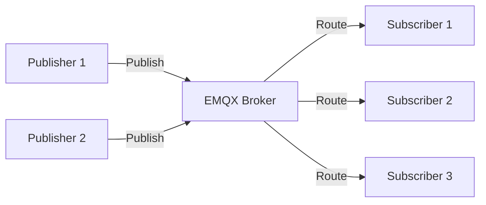
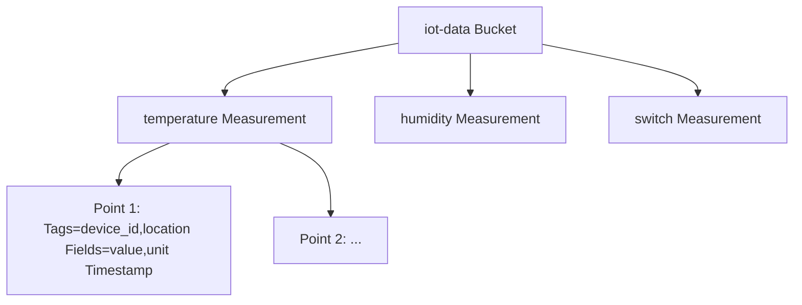
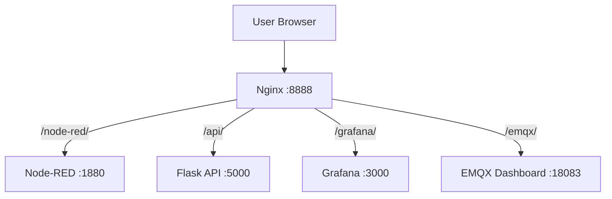
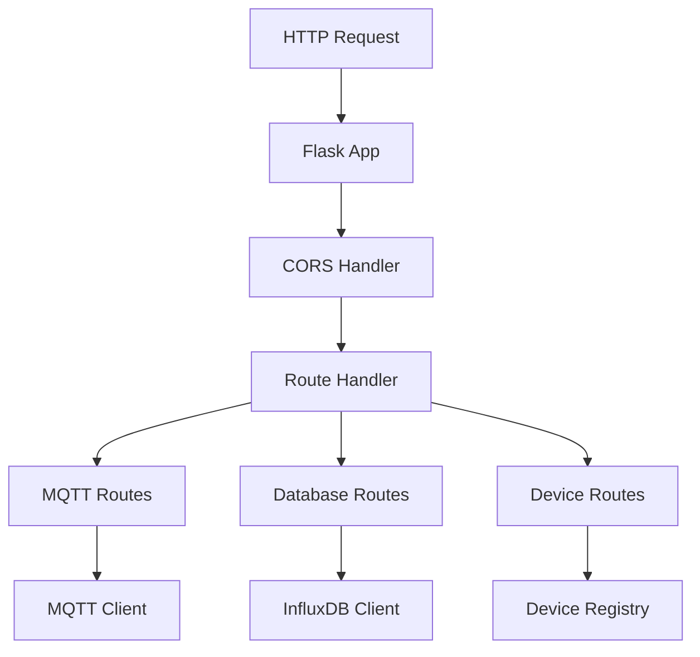
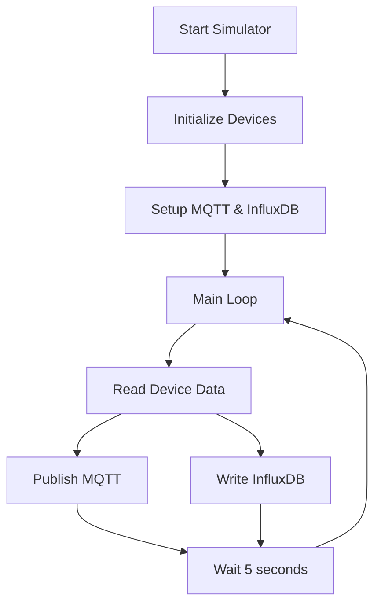
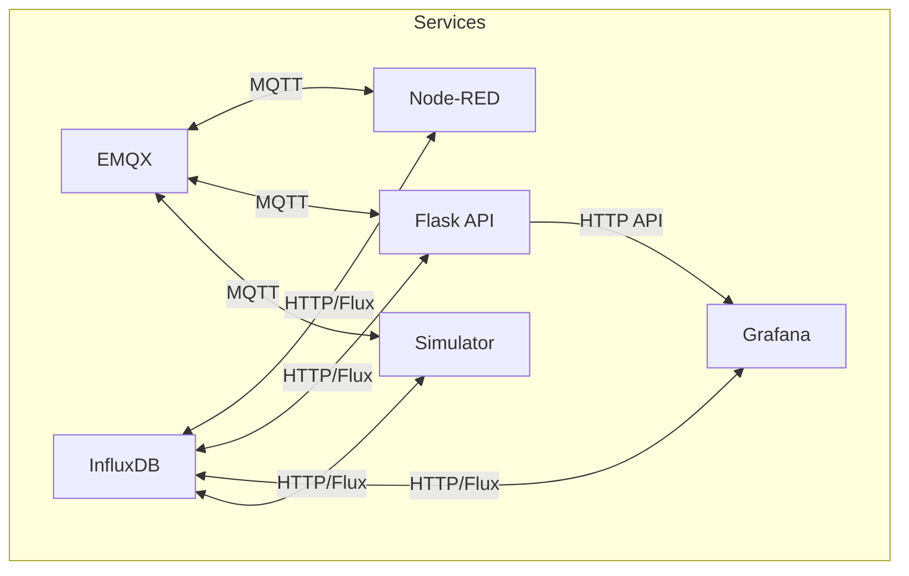
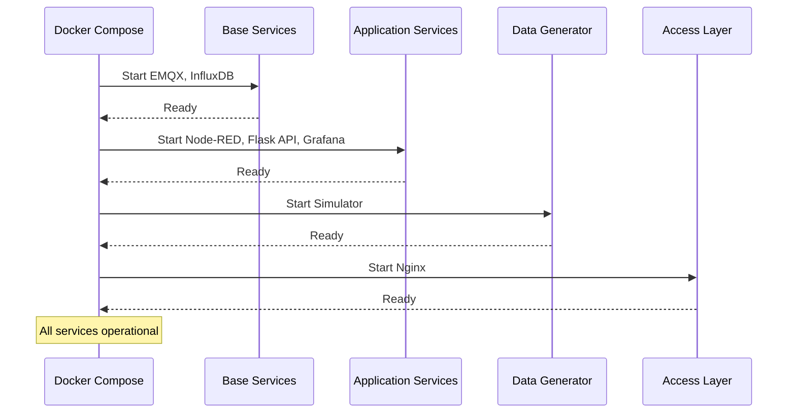

# Component Details

Detailed documentation of each component in the IoT Home Automation Learning Platform.

## Table of Contents

1. [Docker Services](#docker-services)
2. [Python Components](#python-components)
3. [Configuration](#configuration)
4. [Inter-Service Communication](#inter-service-communication)

## Docker Services

### EMQX MQTT Broker

**Purpose**: Message broker for IoT device communication

**Configuration**:
- **Image**: `emqx/emqx:5.3`
- **Container Name**: `iot-emqx`
- **Internal Hostname**: `emqx`
- **Ports**:
  - 1883: MQTT protocol
  - 8083: MQTT over WebSocket
  - 8084: MQTT over SSL
  - 18083: Dashboard UI

**Network Access**:
- **From Containers**: `emqx:1883`
- **From Host**: `localhost:1883`

**Data Flow**:


**Topic Patterns**:
- Wildcards: `+` (single level), `#` (multi-level)
- Example: `sensors/+/+` matches `sensors/temperature/temp-001`

**Persistent Data**:
- `emqx-data`: MQTT session data
- `emqx-log`: Log files

### InfluxDB

**Purpose**: Time-series database for sensor data storage

**Configuration**:
- **Image**: `influxdb:2.7`
- **Container Name**: `iot-influxdb`
- **Internal Hostname**: `influxdb`
- **Port**: 8086

**Initialization**:
- **Organization**: `iot-org`
- **Bucket**: `iot-data`
- **Admin Token**: `my-super-secret-auth-token`
- **Username**: `admin`
- **Password**: `admin123456`

**Data Model**:


**Query Language**: Flux

**Persistent Data**:
- `influxdb-data`: Database files
- `influxdb-config`: Configuration

### Node-RED

**Purpose**: Visual flow programming and dashboard

**Configuration**:
- **Base Image**: `nodered/node-red:latest`
- **Custom Build**: Includes @flowfuse/node-red-dashboard
- **Container Name**: `iot-node-red`
- **Port**: 1880

**Features**:
- Flow-based programming
- FlowFuse Dashboard (Dashboard 2)
- MQTT integration
- InfluxDB nodes
- HTTP endpoints

**Dashboard Access**:
- Editor: http://localhost:1880
- Dashboard: http://localhost:1880/ui

**Persistent Data**:
- `node-red-data`: Flows, settings, installed nodes

**Pre-installed Nodes**:
- `@flowfuse/node-red-dashboard`: Dashboard widgets
- `node-red-contrib-influxdb`: InfluxDB integration

### Flask API

**Purpose**: REST API for Python interactions

**Configuration**:
- **Base Image**: `python:3.11-slim`
- **Container Name**: `iot-flask-api`
- **Port**: 5000

**Endpoints**:

```mermaid
graph TB
    API[Flask API] --> MQTT_Route["/mqtt/* - MQTT Operations"]
    API --> DB_Route["/database/* - Database Operations"]
    API --> Device_Route["/devices/* - Device Management"]
    
    MQTT_Route --> MQTT_Pub[/publish]
    MQTT_Route --> MQTT_Sub[/subscribe]
    MQTT_Route --> MQTT_Test[/test]
    
    DB_Route --> DB_Write[/write]
    DB_Route --> DB_Query[/query]
    DB_Route --> DB_Test[/test]
    
    Device_Route --> Dev_Reg[/register]
    Device_Route --> Dev_List[/list]
    Device_Route --> Dev_Get[/:device_id]
```

**Dependencies**:
- Flask
- flask-cors
- paho-mqtt
- influxdb-client
- requests

**Volume Mounts**:
- Code mounted for development: `../api:/app`

### Grafana

**Purpose**: Advanced data visualization

**Configuration**:
- **Image**: `grafana/grafana:10.2.0`
- **Container Name**: `iot-grafana`
- **Port**: 3000
- **Credentials**: admin/admin

**Pre-configured**:
- InfluxDB datasource (auto-provisioned)
- Sample dashboards (provisioned)

**Access**:
- UI: http://localhost:3000
- API: http://localhost:3000/api

**Persistent Data**:
- `grafana-data`: Dashboards, users, settings

### Nginx

**Purpose**: Reverse proxy and unified access

**Configuration**:
- **Image**: `nginx:alpine`
- **Container Name**: `iot-nginx`
- **Port**: 8888 (external), 80 (internal)

**Routing**:


**Configuration File**: `docker/nginx/nginx.conf`

### IoT Simulator

**Purpose**: Generate realistic sensor data

**Configuration**:
- **Base Image**: `python:3.11-slim`
- **Container Name**: `iot-simulator`
- **No External Ports**: Internal only

**Devices**:
- 2 Temperature sensors
- 2 Humidity sensors
- 2 Smart switches

**Publishing**:
- Interval: 5 seconds
- Topics: `sensors/{type}/{device_id}`
- Also writes to InfluxDB

## Python Components

### Python Environment

**Location**: Project root
**Virtual Environment**: `venv/`

**Dependencies** (`requirements.txt`):
```
paho-mqtt==1.6.1          # MQTT client
influxdb-client==1.38.0   # InfluxDB client
requests==2.31.0           # HTTP client
python-dotenv==1.0.0       # Environment variables
```

### Workshop Code Structure

```
workshop/code/
├── workshop-01/          # Introduction & setup
├── workshop-02/          # MQTT basics
├── workshop-03/          # Database operations
├── workshop-04/          # REST API
├── workshop-05/          # Node-RED integration
├── workshop-06/          # Data visualization
├── workshop-07/          # IoT simulator
├── workshop-08/          # Home automation
├── workshop-09/          # Advanced topics
└── workshop-10/          # Capstone project
```

### API Service

**Location**: `api/`

**Structure**:
```
api/
├── app.py                 # Flask application
├── requirements.txt      # Dependencies
├── Dockerfile            # Container definition
└── routes/
    ├── __init__.py
    ├── mqtt.py           # MQTT endpoints
    ├── database.py       # Database endpoints
    └── devices.py         # Device management
```

**Application Flow**:


### Simulator Service

**Location**: `simulator/`

**Structure**:
```
simulator/
├── iot_simulator.py      # Main simulator
├── Dockerfile
├── requirements.txt
└── devices/
    ├── __init__.py
    ├── temperature_sensor.py
    ├── humidity_sensor.py
    └── smart_switch.py
```

**Simulator Flow**:


## Configuration

### Environment Variables

**Location**: `.env` (created from `env.example`)

**Key Variables**:

| Variable | Default | Purpose |
|----------|---------|---------|
| `MQTT_BROKER` | localhost | MQTT broker address |
| `MQTT_PORT` | 1883 | MQTT port |
| `INFLUXDB_URL` | http://localhost:8086 | InfluxDB URL |
| `INFLUXDB_TOKEN` | my-super-secret-auth-token | Auth token |
| `INFLUXDB_ORG` | iot-org | Organization name |
| `INFLUXDB_BUCKET` | iot-data | Bucket name |
| `FLASK_API_URL` | http://localhost:5000 | API URL |
| `GRAFANA_URL` | http://localhost:3000 | Grafana URL |

### Docker Compose Configuration

**Network**: `iot-network` (bridge network)

**Volumes**:
- `influxdb-data`: Persistent database
- `influxdb-config`: InfluxDB config
- `emqx-data`: MQTT state
- `emqx-log`: MQTT logs
- `node-red-data`: Node-RED flows
- `grafana-data`: Grafana data

**Health Checks**: All services have health checks

## Inter-Service Communication

### Communication Matrix



### Protocol Details

#### MQTT Communication

**Protocol**: MQTT 3.1.1 / 5.0
**Port**: 1883
**QoS Levels**: 0, 1, 2

**Connection Pattern**:
```python
# From Python (host machine)
client = mqtt.Client()
client.connect("localhost", 1883, 60)

# From Docker container
client.connect("emqx", 1883, 60)  # Use container name
```

#### HTTP Communication

**Protocol**: HTTP/1.1
**Content-Type**: application/json

**Flask API Endpoints**:
- Base URL: `http://localhost:5000` (from host)
- Base URL: `http://flask-api:5000` (from container)

**InfluxDB API**:
- Base URL: `http://localhost:8086` (from host)
- Base URL: `http://influxdb:8086` (from container)

#### Database Queries

**Language**: Flux
**API**: HTTP POST with Flux query in body

**Example**:
```flux
from(bucket: "iot-data")
  |> range(start: -1h)
  |> filter(fn: (r) => r["_measurement"] == "temperature")
  |> filter(fn: (r) => r["_field"] == "value")
```

## Service Lifecycle

### Startup Sequence



### Shutdown Sequence

1. Stop data generators (simulator)
2. Stop access layer (nginx)
3. Stop application services
4. Stop base services
5. Cleanup network and volumes (optional)

## Resource Requirements

### Minimum Requirements

- **CPU**: 2 cores
- **RAM**: 4 GB
- **Disk**: 10 GB free space
- **Docker**: 2 GB available

### Recommended Requirements

- **CPU**: 4 cores
- **RAM**: 8 GB
- **Disk**: 20 GB free space
- **Docker**: 4 GB available

### Service Resource Usage

| Service | CPU | RAM | Disk |
|---------|-----|-----|------|
| EMQX | Low | ~200 MB | ~100 MB |
| InfluxDB | Medium | ~500 MB | Variable (data) |
| Node-RED | Low | ~150 MB | ~50 MB |
| Flask API | Low | ~100 MB | ~50 MB |
| Grafana | Low | ~200 MB | ~100 MB |
| Nginx | Very Low | ~20 MB | ~10 MB |
| Simulator | Very Low | ~50 MB | ~10 MB |

## Troubleshooting by Component

### EMQX Issues

**Symptoms**: Connection refused, messages not delivered

**Solutions**:
- Check container is running: `docker-compose ps emqx`
- Verify port 1883 is not blocked
- Check logs: `docker-compose logs emqx`
- Verify network connectivity

### InfluxDB Issues

**Symptoms**: Write failures, query errors

**Solutions**:
- Verify token and organization
- Check bucket exists
- Review Flux query syntax
- Check disk space

### Node-RED Issues

**Symptoms**: Dashboard not loading, flows not working

**Solutions**:
- Check @flowfuse/node-red-dashboard is installed
- Verify MQTT broker connection
- Check flow deployment
- Review browser console

### Flask API Issues

**Symptoms**: API not responding, connection errors

**Solutions**:
- Check service is running
- Verify dependencies installed
- Review application logs
- Test health endpoint

## Related Documentation

- [Architecture Overview](architecture-overview.md) - System overview
- [Data Flow](data-flow.md) - Data flow details
- [Workshop Documentation](../workshop-*.md) - Workshop guides

