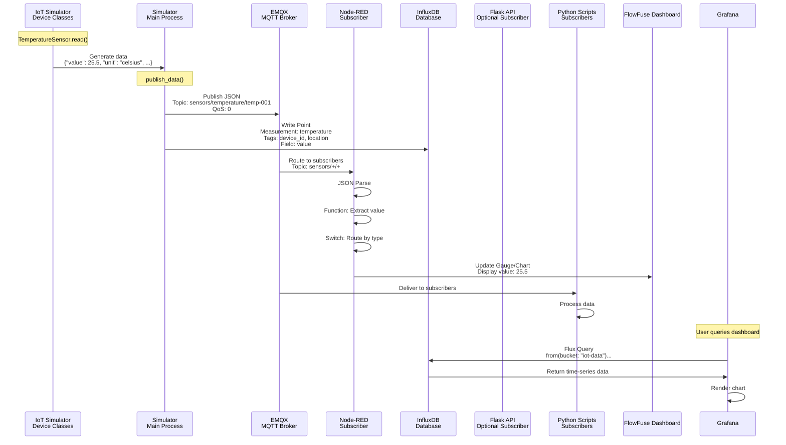
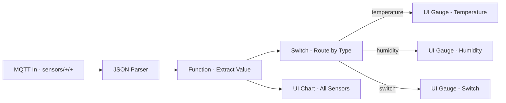
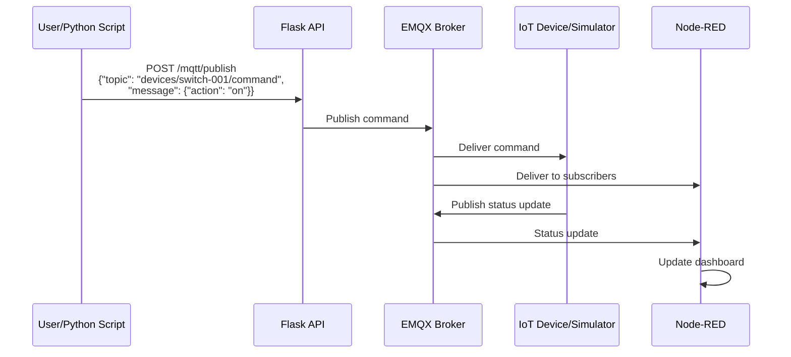
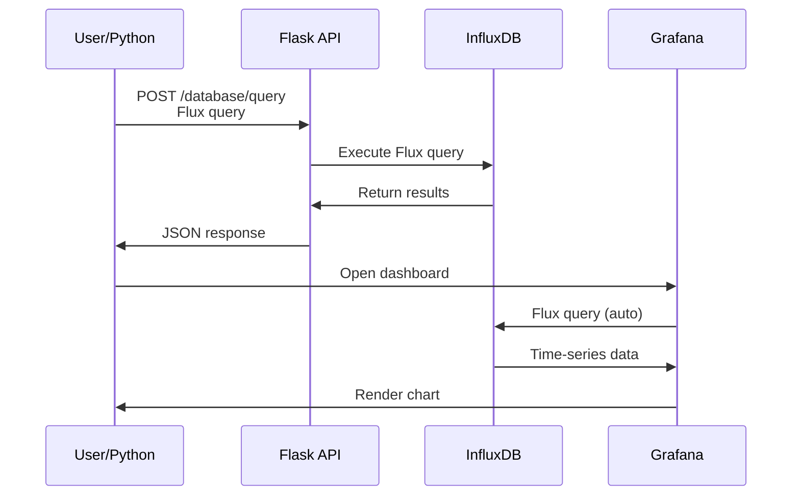
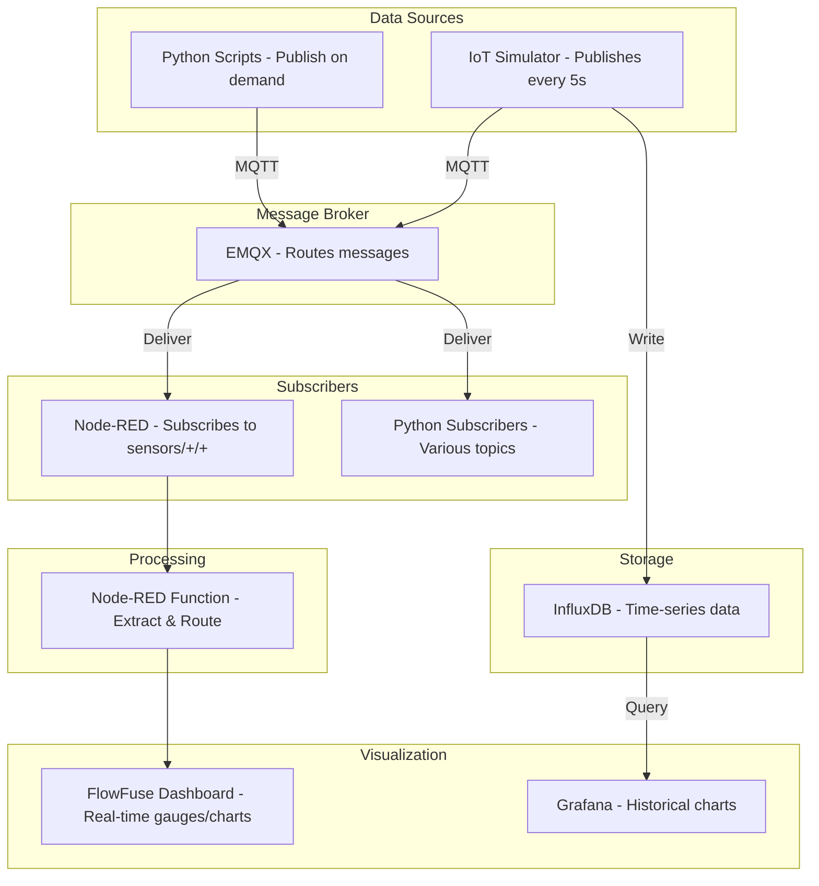
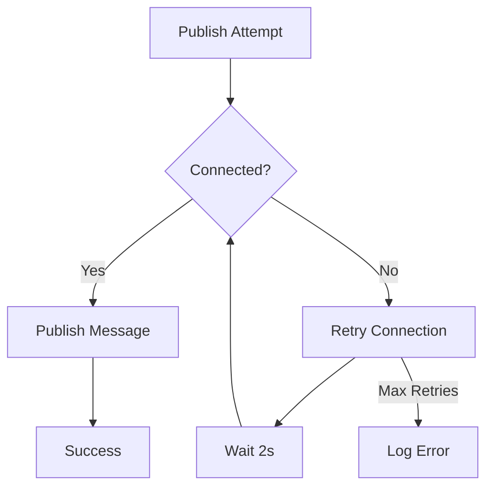

# Data Flow Architecture

This document explains how data flows through the IoT Home Automation Learning Platform, from sensor simulation to visualization.

## Table of Contents

1. [Data Flow Overview](#data-flow-overview)
2. [Sensor Data Flow](#sensor-data-flow)
3. [Command Flow](#command-flow)
4. [Query Flow](#query-flow)
5. [Visualization Flow](#visualization-flow)
6. [Data Formats](#data-formats)

## Data Flow Overview

The platform supports multiple data flow patterns:

1. **Publish-Subscribe**: MQTT-based messaging
2. **Request-Response**: HTTP REST API
3. **Time-Series Storage**: InfluxDB writes/queries
4. **Real-time Visualization**: Dashboard updates

## Sensor Data Flow

### Complete Sensor Data Journey



### Step-by-Step: Sensor Data Publishing

#### Step 1: Data Generation

**Location**: `simulator/devices/temperature_sensor.py`

```python
def read(self):
    temperature = self.base_temp + random.uniform(-self.variance, self.variance)
    return {
        'value': round(temperature, 2),
        'unit': 'celsius',
        'location': self.location,
        'timestamp': datetime.utcnow().isoformat()
    }
```

**Output Format**:
```json
{
  "value": 25.5,
  "unit": "celsius",
  "location": "living-room",
  "timestamp": "2025-12-12T12:00:00.000000"
}
```

#### Step 2: MQTT Publishing

**Location**: `simulator/iot_simulator.py`

```python
def publish_data(self, device, data):
    topic = f"sensors/{device.device_type}/{device.device_id}"
    payload = json.dumps(data)
    self.mqtt_client.publish(topic, payload)
```

**MQTT Message**:
- **Topic**: `sensors/temperature/temp-001`
- **Payload**: JSON string (see above)
- **QoS**: 0 (default)

#### Step 3: MQTT Routing

**EMQX Broker**:
- Receives message on topic `sensors/temperature/temp-001`
- Matches subscribers to pattern `sensors/+/+`
- Delivers to all matching subscribers

**Subscribers**:
- Node-RED: `sensors/+/+` (matches all 3-level topics)
- Python Scripts: Various topic patterns
- Flask API: Optional subscriber

#### Step 4: Data Storage

**InfluxDB Write**:
```python
point = Point("temperature") \
    .tag("device_id", "temp-001") \
    .tag("location", "living-room") \
    .field("value", 25.5) \
    .time(datetime.utcnow())

write_api.write(bucket="iot-data", org="iot-org", record=point)
```

**Storage Structure**:
- **Measurement**: `temperature`
- **Tags**: `device_id=temp-001`, `location=living-room`
- **Fields**: `value=25.5`, `unit=celsius`
- **Timestamp**: Current UTC time

#### Step 5: Data Processing in Node-RED



**Function Node Code**:
```javascript
var value = msg.payload.value;  // Extract: 25.5
var topicParts = msg.topic.split('/');
var sensorType = topicParts[1];  // "temperature"

msg.payload = value;  // Set to numeric value
msg.sensorType = sensorType;

return msg;
```

#### Step 6: Visualization

**FlowFuse Dashboard**:
- Gauge receives numeric value (25.5)
- Displays with configured min/max/units
- Updates in real-time

**Grafana**:
- Queries InfluxDB using Flux
- Displays time-series chart
- Shows historical data

## Command Flow

### Sending Commands to Devices



### Command Flow Example

**Python Script**:
```python
import requests

# Send command via API
response = requests.post(
    "http://localhost:5000/mqtt/publish",
    json={
        "topic": "devices/switch-001/command",
        "message": {"action": "on", "device_id": "switch-001"}
    }
)
```

**Flow**:
1. Python → Flask API (HTTP POST)
2. Flask API → EMQX (MQTT Publish)
3. EMQX → Device/Simulator (MQTT Delivery)
4. Device processes command
5. Device publishes status update
6. Status flows back through MQTT

## Query Flow

### Querying Historical Data



### Query Examples

#### Via Flask API

```python
import requests

query = '''
from(bucket: "iot-data")
  |> range(start: -1h)
  |> filter(fn: (r) => r["_measurement"] == "temperature")
  |> filter(fn: (r) => r["_field"] == "value")
'''

response = requests.post(
    "http://localhost:5000/database/query",
    json={"query": query}
)
```

#### Direct InfluxDB Query

```python
from influxdb_client import InfluxDBClient

client = InfluxDBClient(url="http://localhost:8086", token="...", org="iot-org")
query_api = client.query_api()

result = query_api.query(org="iot-org", query=query)
```

## Visualization Flow

### Real-Time Dashboard Updates



### Update Frequency

- **Simulator**: Every 5 seconds (configurable)
- **Dashboard**: Updates on each message arrival
- **Grafana**: Updates on query/refresh
- **Charts**: Real-time as data arrives

## Data Formats

### MQTT Message Format

**Topic Structure**:
```
sensors/{device_type}/{device_id}
```

**Examples**:
- `sensors/temperature/temp-001`
- `sensors/humidity/hum-001`
- `sensors/switch/switch-001`

**Payload Format**:
```json
{
  "value": 49.67,
  "unit": "percent",
  "location": "living-room",
  "timestamp": "2025-12-12T12:02:35.380018"
}
```

### InfluxDB Data Format

**Point Structure**:
```
Measurement: temperature
Tags:
  - device_id: temp-001
  - device_type: temperature
  - location: living-room
Fields:
  - value: 25.5 (float)
  - unit: "celsius" (string)
Timestamp: 2025-12-12T12:02:35Z
```

**Flux Query Result**:
```json
{
  "results": [
    {
      "time": "2025-12-12T12:02:35Z",
      "measurement": "temperature",
      "field": "value",
      "value": 25.5,
      "tags": {
        "device_id": "temp-001",
        "location": "living-room"
      }
    }
  ]
}
```

### REST API Request/Response

**Publish MQTT Request**:
```json
POST /mqtt/publish
{
  "topic": "sensors/data",
  "message": {
    "temperature": 25.5,
    "humidity": 60
  },
  "qos": 1
}
```

**Response**:
```json
{
  "success": true,
  "topic": "sensors/data",
  "message": {...},
  "message_id": 123
}
```

**Database Write Request**:
```json
POST /database/write
{
  "measurement": "temperature",
  "fields": {
    "value": 25.5,
    "unit": "celsius"
  },
  "tags": {
    "device_id": "temp-001",
    "location": "living-room"
  }
}
```

## Data Flow Patterns

### Pattern 1: Simulator → Dashboard (Real-time)

```
Simulator Device
  → Generate data
  → Publish MQTT (sensors/temperature/temp-001)
  → EMQX routes
  → Node-RED receives
  → Extract value
  → Update gauge
  → User sees update (< 1 second latency)
```

### Pattern 2: Python → API → Database → Grafana

```
Python Script
  → HTTP POST /database/write
  → Flask API processes
  → Write to InfluxDB
  → Data stored
  → Grafana queries
  → Display in dashboard
```

### Pattern 3: Python → MQTT → Multiple Consumers

```
Python Script
  → Publish MQTT message
  → EMQX receives
  → Routes to all subscribers:
     ├─→ Node-RED (dashboard update)
     ├─→ Flask API (processing)
     ├─→ Other Python scripts
     └─→ InfluxDB (via bridge/rule)
```

## Data Transformation Points

### Transformation 1: JSON String → Object

**Location**: Node-RED JSON node, Python `json.loads()`

**Input**: `'{"value": 25.5, "unit": "celsius"}'`
**Output**: `{"value": 25.5, "unit": "celsius"}`

### Transformation 2: Object → Numeric Value

**Location**: Node-RED Function node

**Input**: `{"value": 25.5, "unit": "celsius", ...}`
**Output**: `25.5` (number)

### Transformation 3: Point → Flux Query Result

**Location**: InfluxDB query processing

**Input**: InfluxDB Point
**Output**: Flux query result array

## Data Retention

### InfluxDB Retention

- **Default**: Data retained indefinitely
- **Configurable**: Set retention policies
- **Storage**: Docker volume `influxdb-data`

### MQTT Message Retention

- **QoS 0**: No retention (fire and forget)
- **QoS 1**: Retained until acknowledged
- **Retained Messages**: Last message kept on topic (if set)

### Dashboard Data

- **FlowFuse Dashboard**: Configurable (e.g., last 1 hour)
- **Grafana**: Queries specific time ranges
- **Charts**: Remove older points based on configuration

## Error Handling in Data Flow

### MQTT Connection Failures



### Database Write Failures

- **Retry Logic**: Implemented in simulator
- **Error Logging**: Errors logged to console
- **Graceful Degradation**: Continues if one service fails

## Performance Considerations

### Message Throughput

- **Simulator**: 6 devices × 1 message/5s = 1.2 msg/s
- **MQTT Broker**: Handles thousands of messages/second
- **Database**: Optimized for time-series writes

### Network Traffic

- **MQTT**: Lightweight protocol (~100 bytes/message)
- **HTTP**: REST API calls (~1-5 KB/request)
- **Database Queries**: Varies by query complexity

## Related Documentation

- [Architecture Overview](architecture-overview.md) - System architecture
- [Component Details](component-details.md) - Individual components
- [Workshop 02: MQTT Basics](workshop-02-mqtt-basics.md) - MQTT fundamentals
- [Workshop 03: Database Operations](workshop-03-database-operations.md) - Database usage

